# 02 — Loop Optimizations

Loops are where programs spend their time, and where the optimizer earns its
keep. This chapter walks through the loop transformations every serious
performance engineer should be able to *recognize in assembly*.

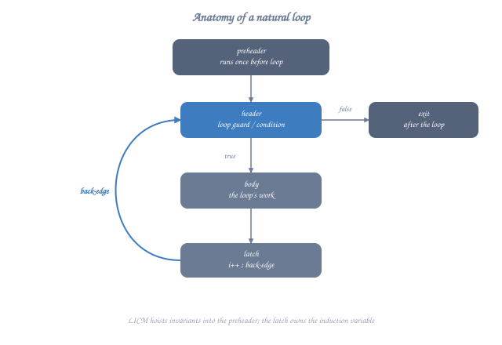

## Map

| #  | Example                          | Optimization                              |
| -- | -------------------------------- | ----------------------------------------- |
| 01 | `01_licm.c`                      | Loop-Invariant Code Motion                |
| 02 | `02_unroll.c`                    | Loop unrolling (full / partial)           |
| 03 | `03_peel.c`                      | Loop peeling                              |
| 04 | `04_unswitch.c`                  | Loop unswitching                          |
| 05 | `05_fusion.c`                    | Loop fusion / jamming                     |
| 06 | `06_fission.c`                   | Loop fission / distribution               |
| 07 | `07_interchange.c`               | Loop interchange                          |
| 08 | `08_tiling.c`                    | Loop tiling / blocking                    |
| 09 | `09_iv_simplification.c`         | Induction-variable simplification         |
| 10 | `10_rerolling.c`                 | Loop rerolling                            |
| 11 | `11_idiom_recognition.c`         | Memset/memcpy/strlen idiom recognition    |
| 12 | `12_versioning.c`                | Loop versioning (alias/alignment runtime checks) |

## Anatomy of a loop in IR

Before any optimization, both LLVM and GCC normalize loops to a **canonical
form**:

<details class="ascii-diagram">
<summary>ASCII diagram</summary>

<pre><code>                            ┌──────────────┐
                            │   preheader  │   single predecessor of header
                            │   (PH)       │   ← invariant code hoists here
                            └──────┬───────┘
                                   ▼
                            ┌──────────────┐
                ┌──────────►│   header (H) │   ← phis live here
                │           │              │
                │           │   φ(IV)      │
                │           └──────┬───────┘
                │                  │
                │           ┌──────▼───────┐
                │           │   body (B)   │
                │           │   ...        │
                │           └──────┬───────┘
                │                  │
                │           ┌──────▼───────┐
                │           │   latch (L)  │   ← back-edge to header
                │           │   IV++       │
                │           │   br cond    │
                │           └──┬───────┬───┘
                └──────────────┘       │
                       back-edge       │ exit
                                       ▼
                                ┌──────────────┐
                                │   exit (X)   │
                                └──────────────┘</code></pre>
</details>

Key vocabulary:

- **Header** — block that all loop paths flow through; phis live here.
- **Latch** — block with the back-edge to the header. A *natural loop* has
  exactly one.
- **Preheader** — the single entry block that flows into the header from
  outside. Created on demand so that *hoisted* invariants have somewhere
  to live.
- **Induction variable (IV)** — a variable that monotonically changes each
  iteration. Modeled by Scalar Evolution (SCEV) in LLVM.
- **Loop-invariant** — an expression whose operands are defined outside the
  loop and which has no side effects inside it.
- **Trip count** — number of iterations. May be a constant, a parameter, or
  symbolically described by SCEV.

You can see all of these in any LLVM IR dump after `-loop-rotate` has run.

---

## 01 · Loop-Invariant Code Motion (LICM)

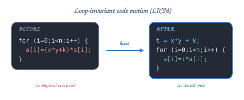

> "If it doesn't depend on the loop, do it *before* the loop."

<details class="ascii-diagram">
<summary>ASCII diagram</summary>

<pre><code>   BEFORE                            AFTER LICM
   ──────                            ──────────
   for (i=0;i&lt;n;i++) {                t = x * y + k;
       a[i] = (x * y + k) * a[i];     for (i=0;i&lt;n;i++) {
   }                                       a[i] = t * a[i];
                                       }</code></pre>
</details>

### Diagram

<details class="ascii-diagram">
<summary>ASCII diagram</summary>

<pre><code>                preheader
                ┌──────────┐
                │   t = …  │ ◄── hoisted here
                └────┬─────┘
                     ▼
           ┌────► header (i, cond)
           │           │
           │     ┌─────▼─────┐
           │     │ body:     │
           │     │  a[i]=t*…│   ← uses t, no longer recomputed
           │     └─────┬─────┘
           │           ▼
           └─── latch (i++)</code></pre>
</details>

### Legality

- The expression must be loop-invariant (no operand defined inside the loop).
- It must be **safe to speculate** — that is, executing it even when the loop
  trips zero times must not crash or trap. `1 / x` is *not* speculatable
  unless `x != 0` is proven. Loads from possibly-null pointers are not.
- It must not have observable side effects (no I/O, no atomics, etc.).

### Where it lives

- **LLVM**: `LICMPass` (works on natural loops, uses MemorySSA for stores).
- **GCC**: `tree-ssa-loop-im.cc` (Invariant Motion).

---

## 02 · Loop unrolling

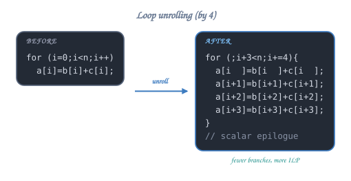

Replicate the loop body N times so each iteration of the new loop covers N
of the old iterations. Trade: more instructions, fewer branches, more
instruction-level parallelism (ILP), better vectorization opportunities.

<details class="ascii-diagram">
<summary>ASCII diagram</summary>

<pre><code>   BEFORE                            AFTER UNROLL BY 4
   ──────                            ─────────────────
   for (i=0;i&lt;n;i++)                 for (i=0; i+3 &lt; n; i+=4) {
       a[i] = b[i] + c[i];               a[i  ] = b[i  ] + c[i  ];
                                          a[i+1] = b[i+1] + c[i+1];
                                          a[i+2] = b[i+2] + c[i+2];
                                          a[i+3] = b[i+3] + c[i+3];
                                      }
                                      // scalar epilogue for i..n</code></pre>
</details>

### Two flavours

1. **Full unroll** — when the trip count is a small known constant
   (`for (i=0;i<4;i++)`). The loop disappears entirely.
2. **Partial unroll by N** — replicate by N, keep a residual epilogue for
   leftovers. N is chosen by a cost model based on the body size and the
   target's pipeline.

### CFG before / after

<details class="ascii-diagram">
<summary>ASCII diagram</summary>

<pre><code>   BEFORE                                AFTER N=4
   ──────                                ─────────
        ┌──header──┐                          ┌──header──┐
        │  cmp i,n │                          │  cmp i+3,n│
        │  br      │                          │  br       │
        └───┬──┬───┘                          └───┬───┬───┘
            │  │ exit                              │   │ exit
            ▼  ▼                                   ▼   ▼
         body                                4× body, then epilogue
            │                                      │
         latch                                  latch (i+=4)
            └─►header                              └─►header</code></pre>
</details>

### Cost-model knobs

- LLVM: `-funroll-loops`, `-mllvm -unroll-count=N`,
  `#pragma clang loop unroll_count(4)`, `unroll(disable|enable|full)`.
- GCC: `-funroll-loops`, `-funroll-all-loops`, `--param max-unroll-times=N`,
  `#pragma GCC unroll N`.

### Pitfalls

- Unrolling **without** vectorization can hurt I-cache and increase
  decode pressure.
- Don't unroll loops with unknown trip counts that average to 2 or 3.

---

## 03 · Loop peeling

Peel **one or more** iterations off the front (or back) of a loop. Helpful
when the first iteration is different (e.g., the initialization of a phi),
or when the trip count is small and the loop body has a predictable startup
penalty.

```
   BEFORE                            AFTER peel-by-1
   ──────                            ────────────────
   for (i=0;i<n;i++) {                if (n > 0) body(0);
       body(i);                       for (i=1;i<n;i++) body(i);
   }
```

When useful:

- Allows another optimization to fire (e.g., `body(0)` becomes a constant).
- Aligns the loop entry (more relevant on older architectures).
- Used heavily by the vectorizer to split off the *prologue* that runs
  scalar until the pointer becomes aligned.

---

## 04 · Loop unswitching

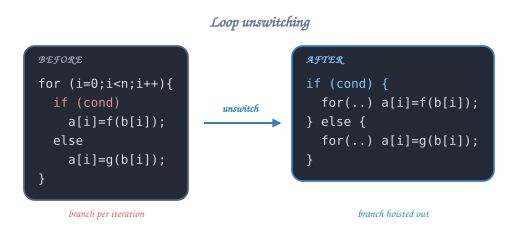

Move a **loop-invariant condition** out of the loop, producing two loops
each with the condition removed.

<details class="ascii-diagram">
<summary>ASCII diagram</summary>

<pre><code>   BEFORE                            AFTER UNSWITCH
   ──────                            ──────────────
   for (i=0;i&lt;n;i++) {                if (cond) {
       if (cond)                          for (i=0;i&lt;n;i++) a[i] = f(b[i]);
           a[i] = f(b[i]);            } else {
       else                               for (i=0;i&lt;n;i++) a[i] = g(b[i]);
           a[i] = g(b[i]);            }
   }</code></pre>
</details>

This **doubles code size** but removes a per-iteration branch and lets each
specialized loop vectorize independently. The cost model is strict.

LLVM pass: `LoopUnswitchPass` (legacy) / `SimpleLoopUnswitchPass` (new).
GCC pass: `tree-ssa-loop-unswitch.cc`.

---

## 05 · Loop fusion (jamming)

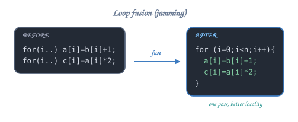

Combine two loops with the *same trip count* into one. Improves cache
locality and removes overhead.

<details class="ascii-diagram">
<summary>ASCII diagram</summary>

<pre><code>   BEFORE                                AFTER FUSE
   ──────                                ──────────
   for (i=0;i&lt;n;i++) a[i] = b[i] + 1;    for (i=0;i&lt;n;i++) {
   for (i=0;i&lt;n;i++) c[i] = a[i] * 2;        a[i] = b[i] + 1;
                                              c[i] = a[i] * 2;
                                          }</code></pre>
</details>

Legality:

- Same trip count.
- No backward dependence (`c[i]` must not need `a[i+1]` from the first loop).

LLVM: `LoopFusePass` (experimental, enabled at `-O3` with caveats).
GCC: `tree-ssa-loop-distribute.cc` (also handles fission, the inverse).

---

## 06 · Loop fission (distribution)

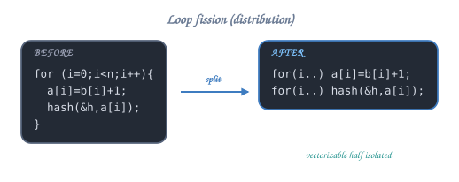

The dual of fusion: split a loop with multiple statements into multiple
loops, each handling a single statement. Beneficial when:

- One statement is vectorizable and the other isn't.
- The aggregate working set doesn't fit in cache, but each part does.

<details class="ascii-diagram">
<summary>ASCII diagram</summary>

<pre><code>   BEFORE                                AFTER FISSION
   ──────                                ─────────────
   for (i=0;i&lt;n;i++) {                    for (i=0;i&lt;n;i++) a[i] = b[i]+1;
       a[i] = b[i] + 1;                   for (i=0;i&lt;n;i++) hash_combine(&amp;h, a[i]);
       hash_combine(&amp;h, a[i]);
   }</code></pre>
</details>

---

## 07 · Loop interchange

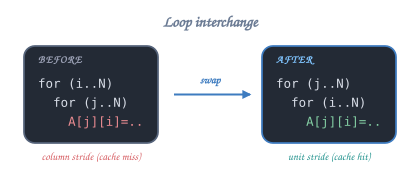

Swap the order of two nested loops.

```c
for (i=0;i<N;i++) for (j=0;j<N;j++) A[i][j] = B[j][i];
```

After interchange:

```c
for (j=0;j<N;j++) for (i=0;i<N;i++) A[i][j] = B[j][i];
```

The point: the *inner* loop now strides through memory the way the array is
laid out, restoring cache locality.

<details class="ascii-diagram">
<summary>ASCII diagram</summary>

<pre><code>   Row-major (C) layout of A[3][4]:
   ┌──┬──┬──┬──┐
   │00│01│02│03│  ◄── inner loop i (stride 1, NOT 4)
   ├──┼──┼──┼──┤
   │10│11│12│13│
   ├──┼──┼──┼──┤
   │20│21│22│23│
   └──┴──┴──┴──┘</code></pre>
</details>

LLVM pass: `LoopInterchangePass` (cost-model driven).
GCC pass: `graphite-interchange.cc` (Polyhedral / Graphite framework).

---

## 08 · Loop tiling (blocking)

For loops whose working set exceeds the cache, partition the iteration space
into *tiles* that fit. Classic matrix-multiplication example:

```c
for (i=0;i<N;i++)
  for (j=0;j<N;j++)
    for (k=0;k<N;k++)
      C[i][j] += A[i][k] * B[k][j];
```

After tiling with block size T:

```c
for (ii=0; ii<N; ii+=T)
  for (jj=0; jj<N; jj+=T)
    for (kk=0; kk<N; kk+=T)
      for (i=ii; i<min(ii+T,N); i++)
        for (j=jj; j<min(jj+T,N); j++)
          for (k=kk; k<min(kk+T,N); k++)
            C[i][j] += A[i][k] * B[k][j];
```

```
   N×N matrix, T = 4 tile:
   ┌─────┬─────┬─────┬─────┐
   │ T₀₀ │ T₀₁ │ T₀₂ │ T₀₃ │
   ├─────┼─────┼─────┼─────┤
   │ T₁₀ │ T₁₁ │ T₁₂ │ T₁₃ │     ← compute one tile fully (fits in L1)
   ├─────┼─────┼─────┼─────┤        before moving to the next
   │ T₂₀ │ T₂₁ │ T₂₂ │ T₂₃ │
   ├─────┼─────┼─────┼─────┤
   │ T₃₀ │ T₃₁ │ T₃₂ │ T₃₃ │
   └─────┴─────┴─────┴─────┘
```

Compilers do this automatically only under specific cost models (LLVM
`-mllvm -enable-loop-distribute`, GCC Graphite `-floop-block`,
`-floop-strip-mine`, `-floop-nest-optimize`). In practice, hand-tile the
inner loops of math libraries and let the compiler vectorize them.

---

## 09 · Induction-variable simplification

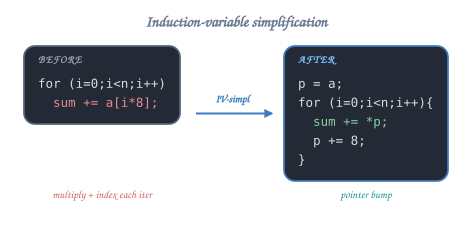

Reduce the strength of induction-variable expressions: `a[i*8]` becomes a
pointer that increments by 8 each iteration.

<details class="ascii-diagram">
<summary>ASCII diagram</summary>

<pre><code>   BEFORE                                AFTER IV-simpl
   ──────                                ──────────────
   for (i=0;i&lt;n;i++) sum += a[i*8];      p = a;
                                          for (i=0;i&lt;n;i++) {
                                              sum += *p;
                                              p += 8;
                                          }</code></pre>
</details>

Both compilers go further and **eliminate redundant IVs** when possible
(one pointer can drive both loops). LLVM: `IndVarSimplifyPass`. GCC:
`tree-ssa-loop-ivopts.cc`.

---

## 10 · Loop rerolling

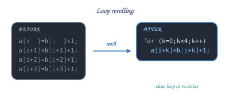

The opposite of unrolling. If source code has been manually unrolled but
the optimizer wants to vectorize, it first **rerolls** so it has a clean
loop to vectorize.

<details class="ascii-diagram">
<summary>ASCII diagram</summary>

<pre><code>   BEFORE (manual unroll-by-4)            AFTER REROLL
   ──────────────────────────             ────────────
   a[i  ] = b[i  ] + 1;                   for (k=0;k&lt;4;k++)
   a[i+1] = b[i+1] + 1;                       a[i+k] = b[i+k] + 1;
   a[i+2] = b[i+2] + 1;
   a[i+3] = b[i+3] + 1;</code></pre>
</details>

LLVM pass: `LoopRerollPass`. Rarely fires; useful for cleaning up bad
hand-written code.

---

## 11 · Loop idiom recognition

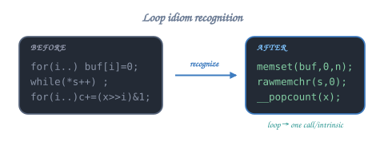

A *loop* that implements a memset/memcpy/strlen/popcount pattern is
replaced by a single call to a library function or to a wide intrinsic.

<details class="ascii-diagram">
<summary>ASCII diagram</summary>

<pre><code>   BEFORE                                AFTER
   ──────                                ─────
   for (i=0;i&lt;n;i++) buf[i] = 0;         memset(buf, 0, n);

   while (*s++) ;                        s = (const char*)__rawmemchr(s, 0);

   for (i=0;i&lt;n;i++) c += (x&gt;&gt;i)&amp;1;       c = __builtin_popcount(x);</code></pre>
</details>

LLVM: `LoopIdiomRecognizePass`. GCC: `tree-loop-distribution.cc` includes
this.

### Pitfall

`-ffreestanding` and `-fno-builtin-memset` disable the recognition because
the compiler can't assume `memset` exists in the runtime.

---

## 12 · Loop versioning

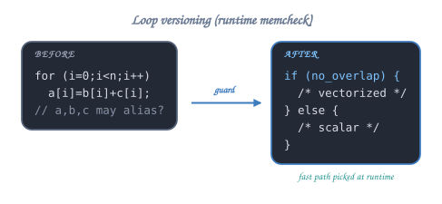

When a critical legality property is unprovable at compile time, the
optimizer can emit a **runtime check** and select between two versions of
the loop:

<details class="ascii-diagram">
<summary>ASCII diagram</summary>

<pre><code>   AFTER VERSIONING
   ────────────────
   if (a + n &lt;= b || b + n &lt;= a) {          // no overlap → safe to vectorize
       /* vectorized version */
       for (i=0;i&lt;n;i++) a[i] = b[i] + c[i];
   } else {
       /* scalar fallback */
       for (i=0;i&lt;n;i++) a[i] = b[i] + c[i];
   }</code></pre>
</details>

LLVM's loop vectorizer routinely emits these "memcheck" guards.

---

## Build & explore

```bash
make all                                 # build object files for inspection
make asm                                 # .s files at -O3
make ll                                  # LLVM IR at -O3
clang -O3 -Rpass=loop-vectorize \
      -Rpass-missed=loop-vectorize \
      -Rpass-analysis=loop-vectorize \
      -c 02_unroll.c -o /dev/null         # human-readable explanation
gcc   -O3 -fopt-info-loop \
      -c 02_unroll.c -o /dev/null         # GCC's equivalent
```

➡ Next: [`03_interprocedural/`](../03_interprocedural/).
