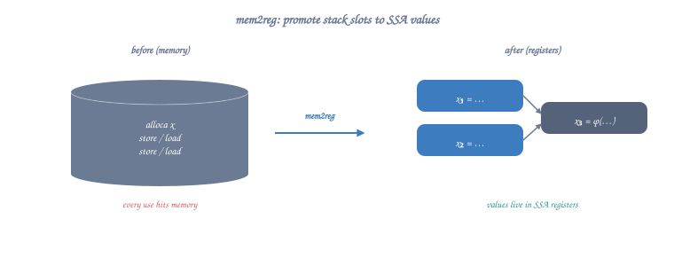
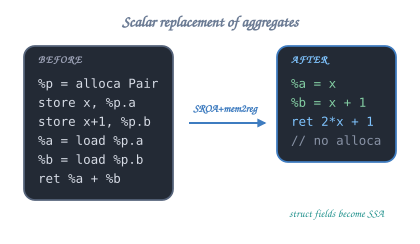
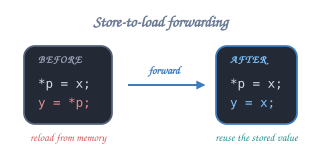
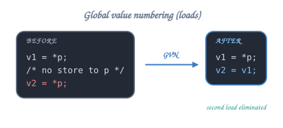
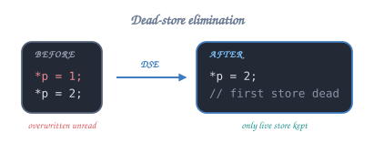
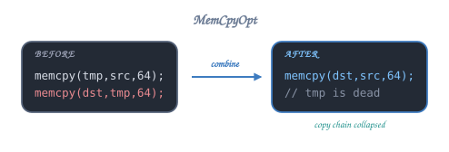
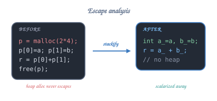

# 06 — Memory Optimizations

Memory is the bottleneck of modern systems, and the optimizer's *single
biggest job* on real programs is **getting things out of memory and into
registers**, or, failing that, **doing fewer loads and stores**.



## Map

| #  | Example                          | Optimization                              |
| -- | -------------------------------- | ----------------------------------------- |
| 01 | `01_mem2reg.c`                   | Promote alloca → SSA values (mem2reg)     |
| 02 | `02_sroa.c`                      | Scalar Replacement of Aggregates          |
| 03 | `03_alias_analysis.c`            | Alias analysis (TBAA, restrict, scoped)   |
| 04 | `04_store_to_load.c`             | Store-to-load forwarding                  |
| 05 | `05_gvn.c`                       | Global Value Numbering for loads          |
| 06 | `06_dead_store_elim.c`           | Dead store elimination (DSE)              |
| 07 | `07_memcpy_opt.c`                | MemCpyOpt (memcpy/memset combining)       |
| 08 | `08_escape_analysis.c`           | Escape analysis (stack-allocate small)    |
| 09 | `09_load_widening.c`             | Load widening / vectorization             |

## The memory hierarchy the optimizer is fighting

```
   ┌───────────────────────────────────────┐
   │ Registers       ~1   cycle            │  ◄── optimizer's goal: live here
   ├───────────────────────────────────────┤
   │ L1 D-cache       4-5 cycles           │
   │ L2 cache        ~12  cycles           │
   │ L3 cache        ~40  cycles           │
   ├───────────────────────────────────────┤
   │ DRAM           ~200  cycles           │  ◄── 50× slower than L1
   └───────────────────────────────────────┘
```

A single avoidable load/store costs more than any arithmetic instruction.
This is why mem2reg, SROA, and store-forwarding are everything.

## 01 · mem2reg — the most important pass in LLVM

Clang emits *unoptimized* code that puts every local variable in an
**alloca** (stack slot) and accesses it through load/store. The `mem2reg`
pass promotes those allocas into proper SSA values, *unless* the address
of the alloca escapes.

```
   BEFORE mem2reg                          AFTER mem2reg
   ──────────────                          ─────────────
   %x = alloca i32                          %x.0 = phi i32 ...
   store i32 %a, ptr %x                     use %x.0 directly
   %t = load i32, ptr %x
   ...
```

Conditions:

- The alloca's address must not be **taken** (no `& x` passed around).
- All uses must be a direct load or store with matching type.

If the alloca's address escapes, SROA may still split a struct alloca into
multiple smaller allocas, some of which then qualify for mem2reg.

Picture:

```
       int x = a; if (cond) x = b; use x;

   BEFORE mem2reg                    AFTER mem2reg
   ──────────────                    ─────────────
       %x = alloca i32                  br i1 cond, %then, %join
       store %a, %x                  then:
       br cond, %then, %join            br %join
   then:                             join:
       store %b, %x                     %x = phi i32 [%a, %entry],
       br %join                                       [%b, %then]
   join:
       %t = load i32, ptr %x
       use %t
```

LLVM: `PromoteMemoryToRegisterPass` ("mem2reg"). GCC equivalent: built
into the SSA-name builder when GIMPLE is first generated.

## 02 · SROA — Scalar Replacement of Aggregates



If a struct alloca is only accessed through individual fields, split it
into separate scalar allocas (which then qualify for mem2reg).

```c
struct Pair { int a; int b; };

int foo(int x) {
    struct Pair p = { x, x+1 };
    return p.a + p.b;
}
```

<details class="ascii-diagram">
<summary>ASCII diagram</summary>

<pre><code>   BEFORE SROA                              AFTER SROA + mem2reg
   ───────────                              ────────────────────
   %p = alloca struct.Pair                  (no alloca at all)
   store %x,     getelementptr(%p,0,0)      %a = %x
   store %x+1,   getelementptr(%p,0,1)      %b = %x + 1
   %a = load     getelementptr(%p,0,0)      ret %a + %b      ;; → 2*%x + 1
   %b = load     getelementptr(%p,0,1)
   ret %a + %b</code></pre>
</details>

LLVM: `SROAPass`. GCC: `tree-sra.cc`.

## 03 · Alias Analysis (AA)

> "May these two memory accesses touch the same byte?"

```
   ┌────────── alias relationships  ──────────┐
   │                                          │
   │  MustAlias     (definitely the same)     │
   │  MayAlias      (we don't know)           │
   │  NoAlias       (definitely disjoint)     │
   │  PartialAlias  (overlap but not equal)   │
   │                                          │
   └──────────────────────────────────────────┘
```

The more often AA returns `NoAlias`, the more LICM, CSE, vectorization, and
store-forwarding can fire. Both compilers ship several AAs:

| AA flavor                | What it knows                                    |
| ------------------------ | ------------------------------------------------ |
| Basic AA                 | local stack, global, distinct allocations        |
| Type-Based AA (TBAA)     | "an `int*` cannot alias a `float*`" (C rule)     |
| Scoped/`restrict` AA     | C99 `restrict`, LLVM `noalias`                   |
| CFL-AA, Andersen, …      | global, context-sensitive (LTO time)             |

You can help AA by:

- Using `restrict` on pointer params that don't overlap.
- Avoiding type-punning (or using `memcpy` instead of cast-through pointer).
- Marking opaque functions with `pure` / `const` so they don't conflict with
  surrounding loads/stores.

## 04 · Store-to-load forwarding



A store of value `v` immediately followed by a load from the *same*
address can be replaced by `v` directly.

<details class="ascii-diagram">
<summary>ASCII diagram</summary>

<pre><code>   BEFORE                            AFTER
   ──────                            ─────
   *p = x;                            *p = x;
   y = *p;                            y = x;</code></pre>
</details>

The hardware does this too (the *store buffer* forwards to subsequent
loads), but the compiler version is even better because it lets the load's
result participate in further optimization.

LLVM: `MemorySSA` + `EarlyCSE` / `GVN`. GCC: `tree-ssa-sccvn.cc`.

## 05 · Global Value Numbering (GVN) for loads



GVN is CSE generalized to handle the entire CFG and memory. It can prove
that two loads from the same address with no intervening store yield the
same value:

<details class="ascii-diagram">
<summary>ASCII diagram</summary>

<pre><code>   v1 = *p;
   ...                  ; some code that does not write through p
   v2 = *p;             ; → v2 = v1</code></pre>
</details>

LLVM: `GVNPass` (and `NewGVNPass`).
GCC: `tree-ssa-pre.cc` / `tree-ssa-sccvn.cc`.

## 06 · Dead Store Elimination (DSE)



If a value is stored and then immediately *overwritten without being read*,
the first store is dead.

```
   *p = 1;                            (gone)
   *p = 2;                            *p = 2;
```

DSE also recognizes overlapping stores: writing `int *p = 0; *p = 1;`
where the first store fully covers the second produces no first store.

<details class="ascii-diagram">
<summary>ASCII diagram</summary>

<pre><code>   memset(buf, 0, 64);                memset(buf, 0, 64);
   memset(buf, 0, 32);                (gone — covered by first memset)</code></pre>
</details>

LLVM: `DSEPass`. GCC: `tree-ssa-dse.cc`.

Counter-example — *atomic* or *volatile* stores are never elided.

## 07 · MemCpyOpt



Recognizes manual copy loops or struct-by-value copies and replaces them
with `memcpy`/`memmove`, or further combines redundant memcpys.

```
   memcpy(tmp, src, 64);              memcpy(dst, src, 64);
   memcpy(dst, tmp, 64);              (tmp is dead)
```

LLVM: `MemCpyOptPass`. GCC: `tree-ssa-strlen.cc` + `tree-loop-distribute-patterns`.

## 08 · Escape analysis



If an allocation **never escapes** the function, it can be:

- Stack-allocated (avoid `malloc/free`).
- Scalarized via SROA.
- Killed entirely if unused.

```c
int sum_pair(int a, int b) {
    int *p = malloc(2 * sizeof(int));   /* could be elided */
    p[0] = a; p[1] = b;
    int r = p[0] + p[1];
    free(p);
    return r;
}
```

In C, escape analysis of `malloc` is limited — the compiler must know it's
the libc allocator and that `free` matches. In C++ it's more powerful for
`new`/`delete`. In Rust/Swift the model gives even stronger guarantees.

LLVM: limited; mostly through inlining + DSE + DCE. GCC: `ipa-pure-const`.

## 09 · Load widening

If the program does:

```c
return p[0] + p[1] + p[2] + p[3];
```

… and `p` is 4-byte aligned, the loop vectorizer can widen this to one
128-bit load and a horizontal reduction. See chapter 08.

➡ Next: [`07_ssa_form/`](../07_ssa_form/).
